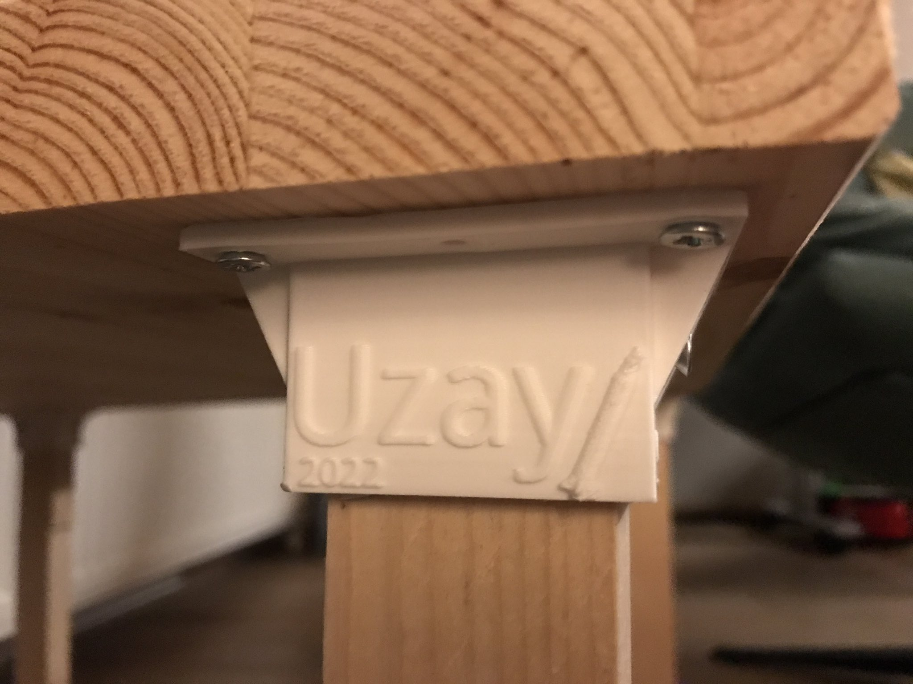

I like things to change, adapt, move. That is defined by chaos but for 
me, it's a peace of mind! Change is the fuel of my brain especially
when it comes to hobbies. BUT!!! when you have a toddler around, this 
comes along with an extra load of keeping things in order.

I have a foldable table already, and I used to keep our crafting material
sort of everywhere e.g. kitchen, library, 3d printing room,
TV unit. Believe me, it's annoying to keep searching for things around.
I'm asking my son to clean up after doing a mess, but again, where's 
the actual locations of things? So, I come up with this brilliant idea
to create a "stable table", and a rack to put all the crafting and
drawing things all together! I don't know why wouldn't I think of this
before?

Never too late!

So, I did some research about 3d print furniture joints, diy kids
crafting tables and, I come up with this one:
 I already had some left over wood pieces and, 
those white pieces are my work! I decided to use ABS since it's
stronger.

Well, I already knew that it would look ugly, hence I wanted to make
it a bit more interesting by customizing it for my son. I put his name,
and added a construction date for this important *piece of art* and put
a nice rocket since he is a fan of rockets :)

Now, I'm waiting for the time when we paint those small details to make
this feel ours. Actually, this is what I like the best about 3d printing.
Even after creating the work, we can still have fun while painting it 
with my son!

And, yes, the table wobbles. Fun, eh?
